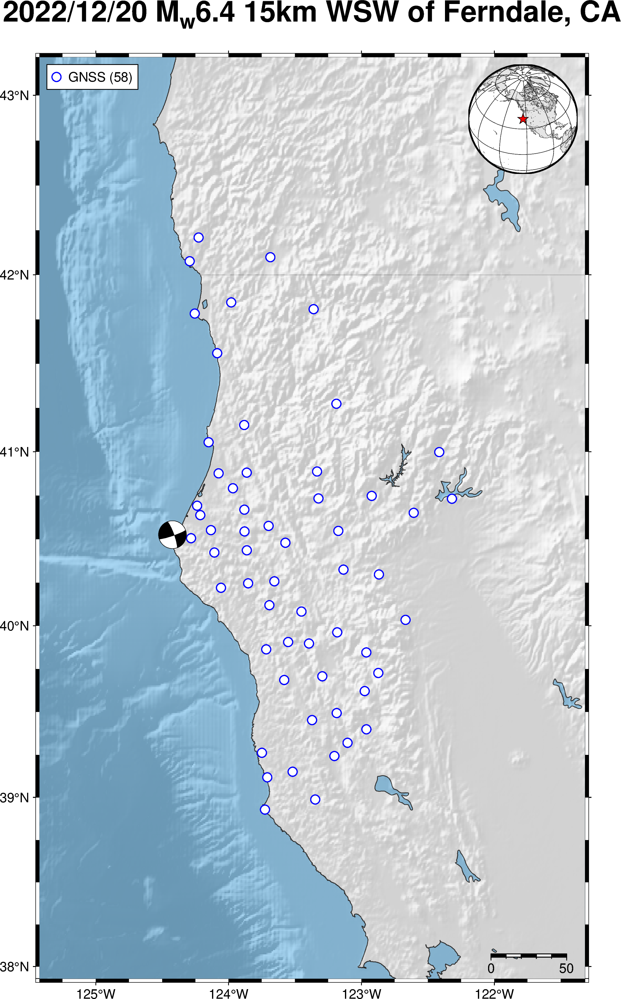
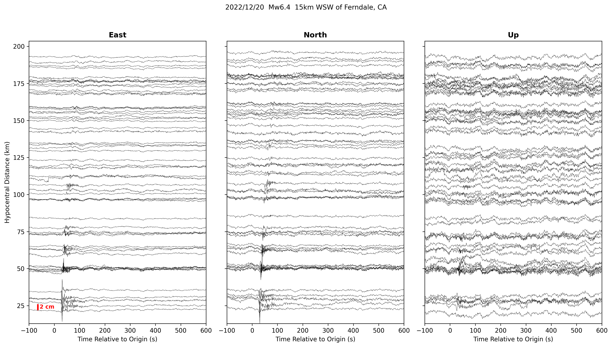

# GNSS Earthquake Pipeline

English | [中文](#中文说明)

This repository contains a generalized GNSS earthquake-processing workflow. It is designed around earthquake event catalogs, high-rate GNSS station availability, event-window downloads, PRIDE PPP-AR processing, quality checks, and normalized plotting/export products.

The workflow is not tied to one country or network. The current workspace includes EarthScope/GAGE coverage for the United States and nearby Americas, GeoNet coverage for New Zealand, and a GA/Geoscience Australia adapter for Australia and the southwest Pacific. Other regions can be added when an event catalog, station metadata, and high-rate GNSS data access are available.

The public repository intentionally keeps only source code, workflow scripts, tests, readable event summaries, and selected README figures. Large local products such as downloaded observations, SQLite databases, workflow runs, normalized exports, and bulk figures are excluded by `.gitignore`.

## Example outputs

The full `data/`, `runs/`, `exports/`, and bulk `figure/` directories are local pipeline products and are not committed. The selected figures below are copied under `docs/images/` only for README display.

### Global station/event coverage

The current normalized export contains 141 events: 62 EarthScope/GAGE events from the United States, 59 EarthScope/GAGE events from the nearby Americas, 18 GeoNet events from New Zealand, and 2 GA/Geoscience Australia events from Australia and the southwest Pacific. Marker color indicates source/region, and marker size scales with earthquake magnitude.


### Event with the most normalized stations

Ferndale, California, 2022-12-20 (`nc73821036`) has the largest normalized station count in this workspace: 58 stations.





## What is included

```text
gnss-earthquake-pipeline/
├── README.md
├── environment.yml
├── pyproject.toml
├── scripts/
│   ├── availability/
│   ├── database/
│   ├── normalize/
│   ├── plotting/
│   ├── quality/
│   └── workflows/
├── src/
│   └── gnss_eq/
│       └── plotting/
├── tests/
└── tools/
    ├── earthscope_downloader/
    ├── ga_downloader/
    ├── geonet_downloader/
    └── pride_processor/
```

## What is not included

The following paths are local data or generated outputs and are ignored:

```text
data/
runs/
exports/
figure/
incoming_plotting_origina/
```

Only the curated images in `docs/images/` are tracked.

## Event catalogs

Readable event catalogs are available under `docs/`, including [`docs/ga_event_catalog.md`](docs/ga_event_catalog.md) for the GA/Australia adapter. EarthScope and GeoNet workflows keep their local event and station metadata in SQLite databases under `data/`, which are generated local products and are not committed.

## Setup

Python package metadata is in `pyproject.toml`; the package requires Python 3.10 or newer.

With conda:

```bash
conda env create -f environment.yml
conda activate gnss-earthscope-pipeline
pip install -e .
```

External runtime tools are not vendored in this repository. Depending on the workflow, the local machine should provide tools such as `curl`, `jq`, `timeout`, `CRX2RNX`, and `pdp3`.

## Main workflow scripts

The repository has separate adapters for each data source, while PRIDE processing, quality checks, and normalized plotting are shared.

Build or update event/station databases:

```bash
scripts/workflows/current_pipeline.sh list-events
python scripts/database/build_geonet_nz_database.py --help
python scripts/database/build_ga_au_database.py --help
python scripts/availability/update_ga_event_highrate_availability.py --help
```

Run event workflows:

```bash
scripts/workflows/run_event_1hz_pride_workflow.sh --help
scripts/workflows/run_event_batch_workflow.sh --help
scripts/workflows/run_geonet_event_1hz_pride_workflow.sh --help
scripts/workflows/run_ga_event_1hz_pride_workflow.sh --help
```

Normalize PRIDE KIN outputs:

```bash
python scripts/normalize/normalize_pride_kin_event.py --help
python scripts/normalize/normalize_ga_pride_kin_event.py --help
```

Compute KIN quality summaries:

```bash
python scripts/quality/compute_kin_quality.py --help
```

## Tests

```bash
python -m unittest discover tests
```

---

# 中文说明

[English](#gnss-earthquake-pipeline) | 中文

本仓库是一个泛化的 GNSS 地震处理流程。流程围绕地震事件目录、高频 GNSS 台站可用性、事件窗口下载、PRIDE PPP-AR 处理、质量检查，以及标准化绘图/导出结果来组织。

这个流程不绑定某一个国家或台网。当前工作区已经包含 EarthScope/GAGE 的美国及美国周边区域、GeoNet 的新西兰区域，以及 GA/Geoscience Australia 的澳大利亚和西南太平洋区域。只要某个地区具备地震事件目录、台站元数据和高频 GNSS 数据接入，就可以继续接入。

公开仓库只保留源码、工作流脚本、测试、可读事件摘要和 README 中展示用的少量图片。大型本地数据产品不会上传，包括下载的观测文件、SQLite 数据库、运行目录、标准化导出结果和批量生成图片。

## 示例输出

完整的 `data/`、`runs/`、`exports/` 和批量 `figure/` 目录都是本地 pipeline 产物，已被 `.gitignore` 排除。下面这些图片是专门复制到 `docs/images/` 中用于 README 展示的精选图片。

### 全球台站/事件分布图

当前 normalized export 共包含 141 个事件：62 个 EarthScope/GAGE 美国事件、59 个 EarthScope/GAGE 美国周边美洲区域事件、18 个 GeoNet 新西兰事件，以及 2 个 GA/Geoscience Australia 澳大利亚和西南太平洋事件。图中标记颜色表示数据来源/区域，标记大小随地震震级缩放。


### 台站数量最多的事件

Ferndale, California，2022-12-20，事件编号 `nc73821036`，是当前工作区中 normalized station 数量最多的事件，共 58 个台站。


## 仓库包含的内容

```text
gnss-earthquake-pipeline/
├── README.md
├── environment.yml
├── pyproject.toml
├── scripts/
│   ├── availability/
│   ├── database/
│   ├── normalize/
│   ├── plotting/
│   ├── quality/
│   └── workflows/
├── src/
│   └── gnss_eq/
│       └── plotting/
├── tests/
└── tools/
    ├── earthscope_downloader/
    ├── ga_downloader/
    ├── geonet_downloader/
    └── pride_processor/
```

## 不上传的内容

以下路径是本地数据或自动生成结果，已被忽略：

```text
data/
runs/
exports/
figure/
incoming_plotting_origina/
```

只有 `docs/images/` 中用于 README 展示的精选图片会被 git 跟踪。

## 地震事件目录

可读事件目录位于 `docs/` 下，包括 GA/澳大利亚适配器的 [`docs/ga_event_catalog.md`](docs/ga_event_catalog.md)。EarthScope 和 GeoNet workflow 的本地事件/台站元数据保存在 `data/` 下的 SQLite 数据库中，这些数据库是本地生成产物，不提交到仓库。

## 环境安装

Python 包配置在 `pyproject.toml` 中，要求 Python 3.10 或更新版本。

使用 conda：

```bash
conda env create -f environment.yml
conda activate gnss-earthscope-pipeline
pip install -e .
```

外部运行依赖不会打包进本仓库。根据具体流程，本地机器需要安装 `curl`、`jq`、`timeout`、`CRX2RNX`、`pdp3` 等工具。

## 主要工作流脚本

仓库为不同数据源保留独立适配器，同时复用 PRIDE 解算、质量检查和标准化绘图流程。

构建或更新事件/台站数据库：

```bash
scripts/workflows/current_pipeline.sh list-events
python scripts/database/build_geonet_nz_database.py --help
python scripts/database/build_ga_au_database.py --help
python scripts/availability/update_ga_event_highrate_availability.py --help
```

运行事件工作流：

```bash
scripts/workflows/run_event_1hz_pride_workflow.sh --help
scripts/workflows/run_event_batch_workflow.sh --help
scripts/workflows/run_geonet_event_1hz_pride_workflow.sh --help
scripts/workflows/run_ga_event_1hz_pride_workflow.sh --help
```

标准化 PRIDE KIN 输出：

```bash
python scripts/normalize/normalize_pride_kin_event.py --help
python scripts/normalize/normalize_ga_pride_kin_event.py --help
```

计算 KIN 质量摘要：

```bash
python scripts/quality/compute_kin_quality.py --help
```

## 测试

```bash
python -m unittest discover tests
```
